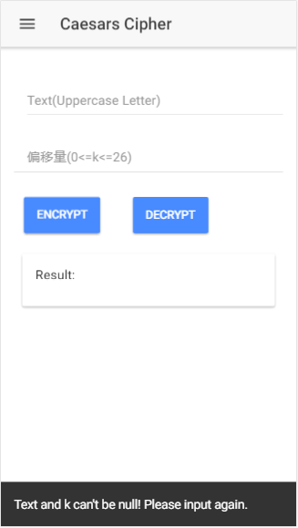
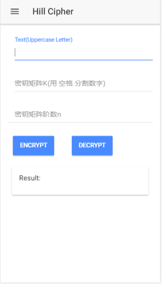
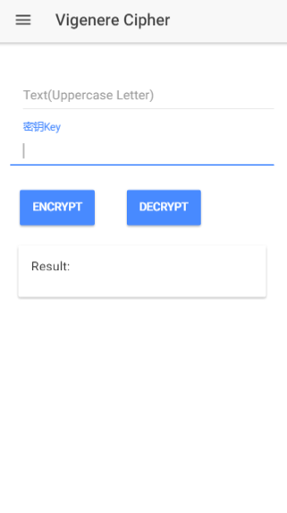

# cryptography-tool
一个可以对Caesars，Hill，Vigenere 密码进行加解密的android App。Android平台安装包为android-debug.apk。

## Getting Started

* Clone this repository: `git clone https://github.com/fivelike/cryptography-tool.git`.

* Run `npm install` or `cnpm install` from the project root.
* Install the ionic CLI (`npm install -g ionic`)
* Run `ionic serve` in a terminal from the project root.

## App Preview

  
  
  
  

